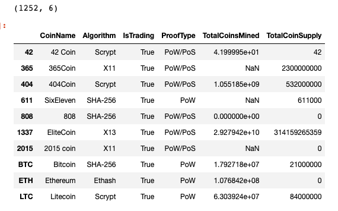
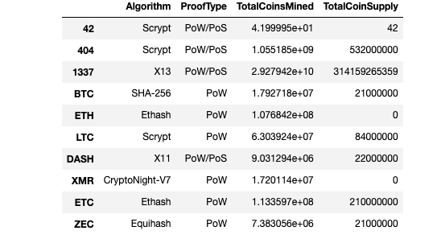
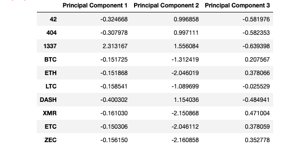
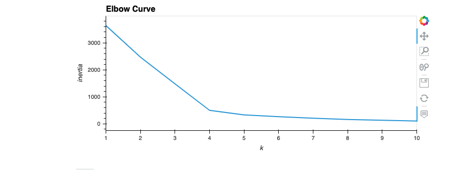
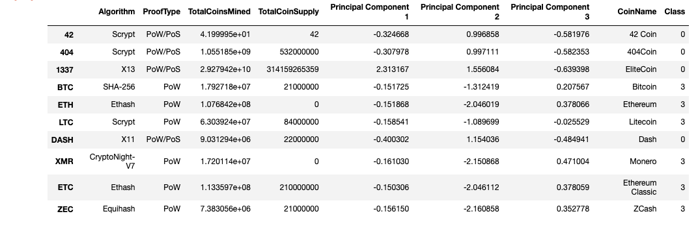
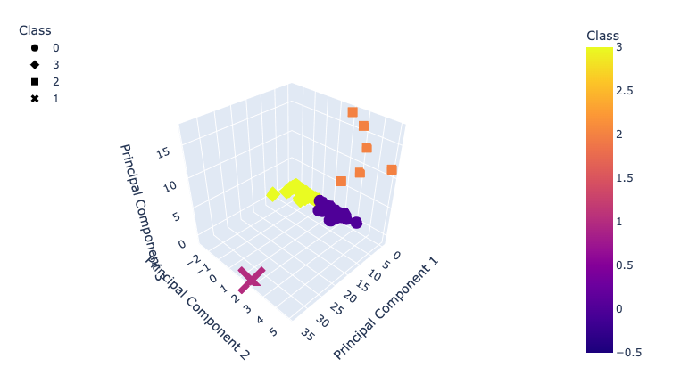
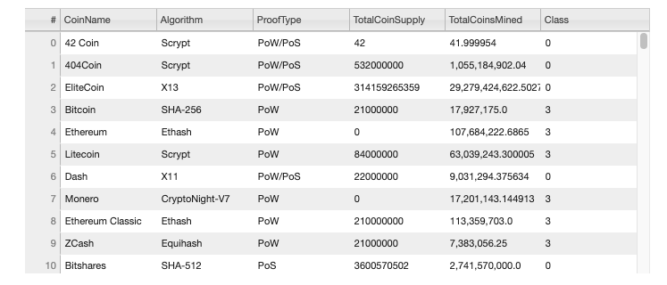
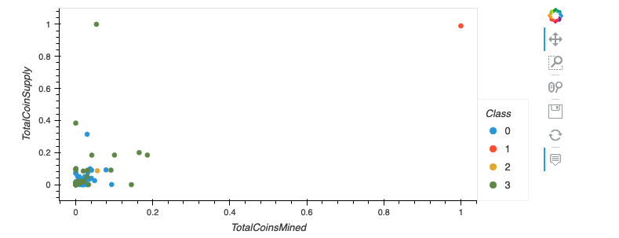

# Cryptocurrencies

## A Brief Overview

The purpose of this analysis to use unsupervised machine learning to analyze a dataset of cryptocurrencies. The goal is to create an investment portfolio of tradable cryptocurrencies for an investment bank to offer for its customers. We will be using a clustering algorithm (K-means) to create a classification system. 

## Results

### Preprocessing the Data

When we first load in the data, the resulting data frame looks like this: 

In order to get the desired workable data, the following actions were performed:
- Drop all cryptos that are not being actively traded, then drop the "IsTrading" column from the data frame
- Remove all null values
- Keep all rows where coins are mined

Once the steps have been completed, the resulting data frame will look like this:

The last two steps to fully pre-process the data are to create dummy variables for text features and then standardize the data using StandardScaler.

### Reducing data dimensions using PCA

The following image portrays the data being split up into three principal components with our pre-processed data. This step allows the machine learning algorithm to analyze the dataset easier and faster

### Clustering Crytocurrencies using K-Means

The following plot demonstrates how many clusters are best for our machine learning model. In this case, the optimal value for k would be 4. From here, we can create our model and fit the model to the PCA data frame to make predictions for our clusters. A new data frame is then created to include predicted clusters and cryptocurrency features

The final step will be to create visualizations for our machine learning model. 

### Visualizations

A 3D rendering of what the clustered data looks like after being split into it's principal components. 

Here is a list of all the tradeable cryptocurrencies available. In total, there are 532. 

Lastly, a 2D plot was made to show the different cryptocurrencies based on two features, Total Coin Supply and Total Coins Mined. 

## Summary

Our machine learning model has identified 532 tradeable cryptocurrencies. Further financial analytics are required to determine their potential efficacy for prospective clients. 

### Sources

Kumar, S. (Ed.). (2023, January 24). How to drop rows that contain a specific value in pandas? GeeksforGeeks. Retrieved April 19, 2023, from https://www.geeksforgeeks.org/how-to-drop-rows-that-contain-a-specific-value-in-pandas/# 